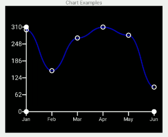
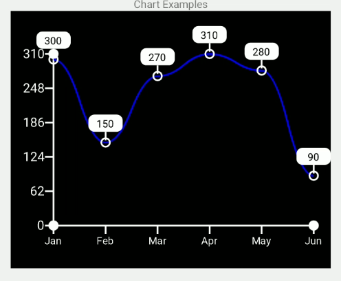

# react-native-starter-app

to run

```js
npm init
```

it is prefferable to open the project in android studio and from the terminal type:

```js
npm run android
```

this is just a starter app with these features

- redux
- drawer navigator
- toast container

to use toast components

```js
import toast from '../helpers/toast';

toast.error({
  message: err.message
})
```

types of toasts

- info
- error
- warning
- success
- danger
- warn

## LineChart

This is a simple line chart currently only capable of handling a single line. Here are the props




### Props

|    Prop name | optional | type | description | default |
| :----------: | :------: | :--: | :---------: | :---: |
| data         | [required] | array | array of data |
| x_key         | [required] | string | field to use for the x axis |
| y_key         | [required] | string | field to use for the Y axis |
| onPressItem   | [✔] | function | returns the item that was clicked |
|height | [✔] | number | height of the chart |
|width | [✔] | number | width of the chart |
|axisWidth | [✔] | number | width of axis lines | 2 |
|axisColor | [✔] | color | color of axis lines | #fff |
|axisCircleColor | [✔] | color | border circles of axis color | #fff |
|axisCircleRadius | [✔] | number | radius of border circles on the axis | 5 |
|useMinValue | [✔] | boolean | use 0 for min value or the smallest value in the dataset | false |
|curve | [✔] | boolean | use bezier curve for the chart line | false |
|lineCircleStroke | [✔] | color | chart line circle stroke color | #fff |
|lineCircleFill | [✔] | color | chart line circle color fill value | transparent |
|lineCircleStrokeWidth | [✔] | number | thickness of chart line circles | 2 |
|lineCircleRadius | [✔] | number | radius of chart line circles | 5 |
|lineStrokeWidth | [✔] | number | thickneess of chart line | 5 |
|lineStroke | [✔] | color | color of chart line | 'blue' |

### x_axis_label_config Props

|    Prop name | optional | type | description | default |
| :----------: | :------: | :--: | :---------: | :---: |
|rotation |  [✔] | number | degrees of rotation for labels | 0 |
|fontSize |  [✔] | number | font size of labels | 15 |
|fontColor |  [✔] | color | color of labels | '#fff' |
|textAnchor |  [✔] | string | anchor property of label | 'middle' |
|fontWeight |  [✔] | string | font weight of label | '400' |